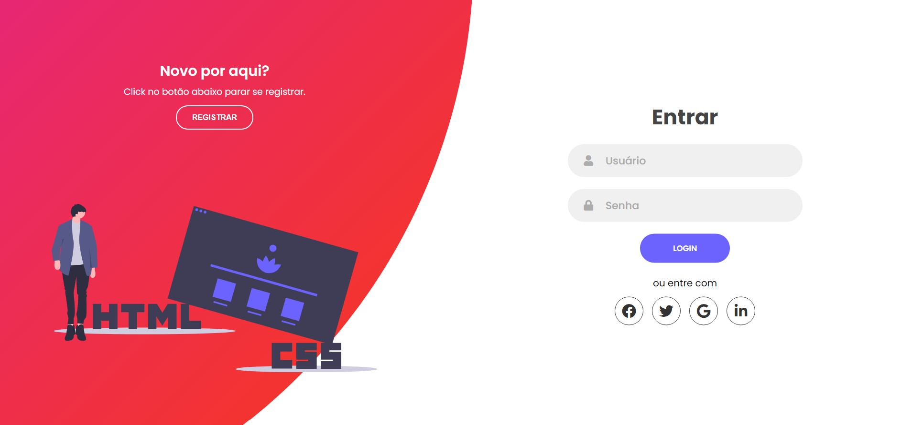

<h1 align="center">
     <a href="#"> Formulário de Registro e Login </a>
</h1>

<h3 align="center">
    🌱 Formulário responsivo para cadastro e login de usuários 💚
</h3>

<h4 align="center">
	🚧   Concluído 🚀 🚧
</h4>

## 💻 Sobre o projeto

♻️ Ecoleta - é uma forma de conectar empresas e entidades de coleta de resíduos orgânicos e inorgânicos as pessoas que precisam descartar seus resíduos de maneira ecológica.

Projeto desenvolvido durante a **NLW - Next Level Week** oferecida pela [Rocketseat](https://blog.rocketseat.com.br/primeira-next-level-week/).
O NLW é uma experiência online com muito conteúdo prático, desafios e hacks onde o conteúdo fica disponível durante uma semana.

---

## ⚙️ Funcionalidades

- [x] Empresas ou entidades podem se cadastrar na plataforma web enviando:

## 🎨 Layout

### Mobile

  

  

### Web

  

  

## 🛠 Tecnologias

As seguintes ferramentas foram usadas na construção do projeto:

-   **[CSS](https://developer.mozilla.org/pt-BR/docs/Web/CSS)**
-   **[HTML](https://developer.mozilla.org/pt-BR/docs/Web/HTML)**
-   **[JavaScript](https://developer.mozilla.org/pt-BR/docs/Web/JavaScript)**

## 🦸 Autor

<a href="https://www.linkedin.com/in/ajdonato/">
 
  
 <b>Amazon Donato</b></a> <a href="https://www.linkedin.com/in/ajdonato/" title="Linkedin">🚀</a>
  

  

---

## 📝 Licença

Esse projeto está licenciado pela MIT LICENSE. Para mais informações detalhadas, leia o arquivo [LICENSE](./LICENSE) contido nesse repositório.

Feito com ❤️ por Amazon Donato 👋🏽 [Entre em contato!](https://www.linkedin.com/in/ajdonato/)

